# Execution Plan — coin-recommender

## Detailed Analysis Summary

### Change Impact Assessment
- **User-facing changes**: No (개인/로컬 API, UI 없음)
- **Structural changes**: Yes — 신규 그린필드 서비스, 9개 신규 컴포넌트(수집/저장/지표/백테스트/스코어링/알림/스케줄러/API)
- **Data model changes**: Yes — 신규 SQLite 스키마 (업비트 캔들 테이블, 바이낸스 참고 캔들 테이블)
- **API changes**: Yes — 신규 `GET /recommendations`, `POST /run`, `GET /health`
- **NFR impact**: Yes — Security Baseline(부분), Resiliency Baseline(코드 레벨), PBT(부분) 적용

### Risk Assessment
- **Risk Level**: Medium — 외부 API 3종(업비트/바이낸스/웹훅) 연동과 통계적 백테스트 로직이 있으나, 로컬 단일 인스턴스로 배포 리스크는 낮음
- **Rollback Complexity**: Easy — 로컬 프로세스, 배포 파이프라인 없음
- **Testing Complexity**: Moderate — 지표 계산 및 기대수익률 로직에 대한 검증이 핵심

## Workflow Visualization

```mermaid
flowchart TD
    Start(["User Request"])

    subgraph INCEPTION["INCEPTION PHASE"]
        WD["Workspace Detection<br/><b>COMPLETED</b>"]
        RA["Requirements Analysis<br/><b>COMPLETED</b>"]
        US["User Stories<br/><b>SKIPPED</b>"]
        WP["Workflow Planning<br/><b>IN PROGRESS</b>"]
        AD["Application Design<br/><b>EXECUTE</b>"]
        UG["Units Generation<br/><b>EXECUTE</b>"]
    end

    subgraph CONSTRUCTION["CONSTRUCTION PHASE"]
        FD["Functional Design per unit<br/><b>EXECUTE</b>"]
        NFRA["NFR Requirements per unit<br/><b>EXECUTE</b>"]
        NFRD["NFR Design per unit<br/><b>EXECUTE</b>"]
        ID["Infrastructure Design per unit<br/><b>SKIP</b>"]
        CG["Code Generation per unit<br/><b>EXECUTE</b>"]
        BT["Build and Test<br/><b>EXECUTE</b>"]
    end

    subgraph OPERATIONS["OPERATIONS PHASE"]
        OPS["Operations<br/><b>PLACEHOLDER</b>"]
    end

    Start --> WD
    WD --> RA
    RA --> US
    US --> WP
    WP --> AD
    AD --> UG
    UG --> FD
    FD --> NFRA
    NFRA --> NFRD
    NFRD --> ID
    ID --> CG
    CG -.->|Next Unit| FD
    CG --> BT
    BT -.-> OPS
    BT --> End(["Complete"])

    style WD fill:#4CAF50,stroke:#1B5E20,stroke-width:3px,color:#fff
    style RA fill:#4CAF50,stroke:#1B5E20,stroke-width:3px,color:#fff
    style WP fill:#4CAF50,stroke:#1B5E20,stroke-width:3px,color:#fff
    style CG fill:#4CAF50,stroke:#1B5E20,stroke-width:3px,color:#fff
    style BT fill:#4CAF50,stroke:#1B5E20,stroke-width:3px,color:#fff
    style US fill:#BDBDBD,stroke:#424242,stroke-width:2px,stroke-dasharray: 5 5,color:#000
    style ID fill:#BDBDBD,stroke:#424242,stroke-width:2px,stroke-dasharray: 5 5,color:#000
    style AD fill:#FFA726,stroke:#E65100,stroke-width:3px,stroke-dasharray: 5 5,color:#000
    style UG fill:#FFA726,stroke:#E65100,stroke-width:3px,stroke-dasharray: 5 5,color:#000
    style FD fill:#FFA726,stroke:#E65100,stroke-width:3px,stroke-dasharray: 5 5,color:#000
    style NFRA fill:#FFA726,stroke:#E65100,stroke-width:3px,stroke-dasharray: 5 5,color:#000
    style NFRD fill:#FFA726,stroke:#E65100,stroke-width:3px,stroke-dasharray: 5 5,color:#000
    style OPS fill:#BDBDBD,stroke:#424242,stroke-width:2px,stroke-dasharray: 5 5,color:#000
    style Start fill:#CE93D8,stroke:#6A1B9A,stroke-width:3px,color:#000
    style End fill:#CE93D8,stroke:#6A1B9A,stroke-width:3px,color:#000

    linkStyle default stroke:#333,stroke-width:2px
```



### Text Alternative

```
INCEPTION PHASE
- Workspace Detection: COMPLETED
- Requirements Analysis: COMPLETED
- User Stories: SKIPPED (single personal user, no persona complexity)
- Workflow Planning: IN PROGRESS (this document)
- Application Design: EXECUTE
- Units Generation: EXECUTE (decompose into 3 units)

CONSTRUCTION PHASE (per unit, in order: data-pipeline -> analytics-backtest -> api-service)
- Functional Design: EXECUTE
- NFR Requirements: EXECUTE
- NFR Design: EXECUTE
- Infrastructure Design: SKIP (no cloud infra, local single instance)
- Code Generation: EXECUTE (always)
- Build and Test: EXECUTE (always, after all units complete)

OPERATIONS PHASE
- Operations: PLACEHOLDER
```

## Phases to Execute

### 🔵 INCEPTION PHASE
- [x] Workspace Detection (COMPLETED)
- [x] Requirements Analysis (COMPLETED)
- [x] User Stories (SKIPPED)
  - **Rationale**: 단일 개인 사용자, 여러 페르소나/이해관계자 없음, 요구사항 단계에서 모든 모호성 해소됨
- [x] Execution Plan (IN PROGRESS)
- [ ] Application Design - **EXECUTE**
  - **Rationale**: 9개 신규 컴포넌트에 대한 책임/메서드/비즈니스 규칙 정의가 필요 (특히 시그널 상태 매칭, 기대수익률 계산 등 핵심 로직)
- [ ] Units Generation - **EXECUTE**
  - **Rationale**: 사용자가 명시적으로 "데이터 수집 → 저장 → 지표 계산" 순서의 단계별 구현과 단계별 검증을 요청함. 3개 단위로 분해하여 각 단위마다 설계+구현+검증 체크포인트를 둠

### 🟢 CONSTRUCTION PHASE (per unit of work)
- [ ] Functional Design - **EXECUTE**
  - **Rationale**: 각 유닛에 신규 데이터 모델 또는 복잡한 비즈니스 로직 존재 (upsert 스키마, 일목균형표 계산, 시그널 상태/기대수익률 계산)
- [ ] NFR Requirements - **EXECUTE**
  - **Rationale**: Security/Resiliency Baseline이 활성화되어 있어 유닛별로 적용 범위를 매핑해야 함; 기술 스택은 이미 사용자가 지정(pyupbit, FastAPI 등) — 확인 위주로 가볍게 진행
- [ ] NFR Design - **EXECUTE**
  - **Rationale**: 외부 호출 타임아웃/재시도, 헬스체크 등 코드 레벨 복원력 패턴을 유닛별로 구체화해야 함
- [ ] Infrastructure Design - **SKIP**
  - **Rationale**: 클라우드 인프라 없음 (로컬 단일 인스턴스, SQLite 파일, IaC 불필요)
- [ ] Code Generation - **EXECUTE (ALWAYS)**
  - **Rationale**: 유닛별 계획 수립 후 코드/테스트 생성
- [ ] Build and Test - **EXECUTE (ALWAYS)**
  - **Rationale**: 전체 유닛 통합 빌드/테스트 지침 필요

### 🟡 OPERATIONS PHASE
- [ ] Operations - PLACEHOLDER

## Proposed Units of Work

사용자가 요청한 구현 순서("데이터 수집 → 저장(upsert) → 일목균형표 계산")를 그대로 유닛 순서에 반영합니다.

1. **Unit 1 — data-pipeline**: `upbit_client.py`, `binance_client.py`, `market_selector.py`, `data_store.py`
   - 후보군 조회, 캔들 수집(부트스트랩+증분), SQLite upsert 저장
2. **Unit 2 — analytics-backtest**: `features.py`, `backtest.py`, `scorer.py`
   - 일목균형표 계산, 시그널 상태 정의, 코인별 과거 수익률 통계, 기대수익률 산출
3. **Unit 3 — api-service**: `api.py`, `scheduler.py`, `notifier.py`
   - FastAPI 엔드포인트, APScheduler 통합, 텔레그램/디스코드 알림

**의존성**: Unit 2는 Unit 1의 저장 데이터에 의존, Unit 3는 Unit 1·2를 오케스트레이션. 따라서 Unit 1 → Unit 2 → Unit 3 순서로 순차 진행합니다.

## Estimated Timeline
- **Total Stages**: Application Design, Units Generation, 3× (Functional Design + NFR Requirements + NFR Design + Code Generation), Build and Test = 약 14개 체크포인트
- **Estimated Duration**: 대화 세션 기준 단계별 순차 진행 (실시간 소요는 각 단계 승인 속도에 따라 다름)

## Success Criteria
- **Primary Goal**: 요구사항에 정의된 추천 로직이 동작하는 FastAPI 서비스 (수집→저장→지표→백테스트→추천→API/알림)
- **Key Deliverables**: 3개 유닛의 동작 코드, 유닛별 테스트(example-based + 부분 PBT), 빌드/실행/테스트 지침 문서
- **Quality Gates**: 각 유닛 Code Generation 완료 시 사용자 승인, Security/Resiliency/PBT 컴플라이언스 요약 통과, 최종 Build and Test 통과
